# EuropeTrans — Landing Page

## About the Client
1
**Ilico Tatiana** is a professional translator with over **22 years of experience**, accredited by the Embassy of the Republic of Bulgaria in Moldova.

She provides translation services across three languages — **Romanian**, **Bulgarian**, and **Russian** — and works directly with clients without intermediaries, guaranteeing confidentiality, high quality, and on-time delivery.

### Services offered

- **Document translation** — personal documents, certificates, diplomas, powers of attorney
- **Legal documentation** — founding documents, court decisions, contracts, financial records
- **Medical documents** — reports, conclusions, pharmaceutical annotations
- **Simultaneous interpretation** — negotiations, conferences, meetings
- **Consular translations** — for the Consulate of the Republic of Bulgaria in Moldova
- 🇧🇬 **Bulgarian citizenship assistance** — full support for the citizenship application process by origin, naturalization, investment, or privilege

### Hero Section

The hero section is the first thing the visitor sees. It features the translator's main headline, the three language flags (Romanian, Bulgarian, Russian), a short description, two CTA buttons, and three animated stat cards (22+ years, 3 languages, 1000+ translations).

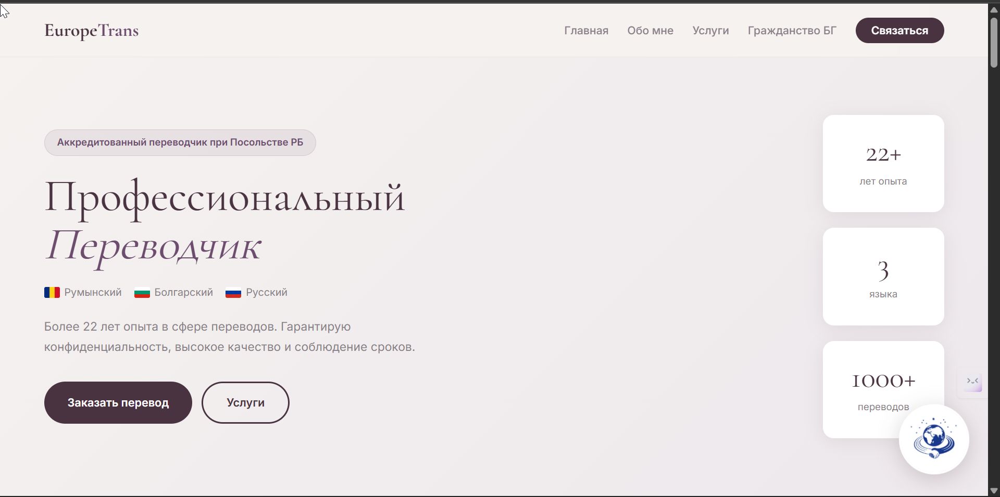

### About Section

The "About Me" bento-grid section showcases the translator's background, licenses, embassy accreditation, and a full list of quality guarantees displayed as pill tags.

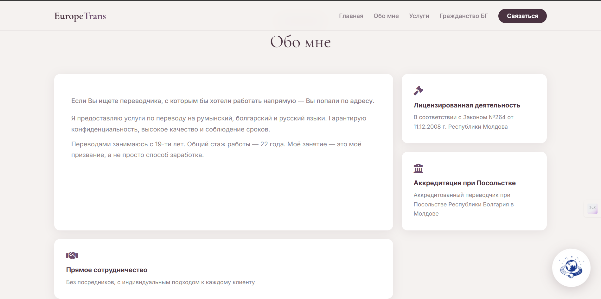

---

### Services Section

A dark-background 3-column grid listing all translation service types with icons, titles, and descriptions. Includes a "Didn't find what you need?" CTA card.

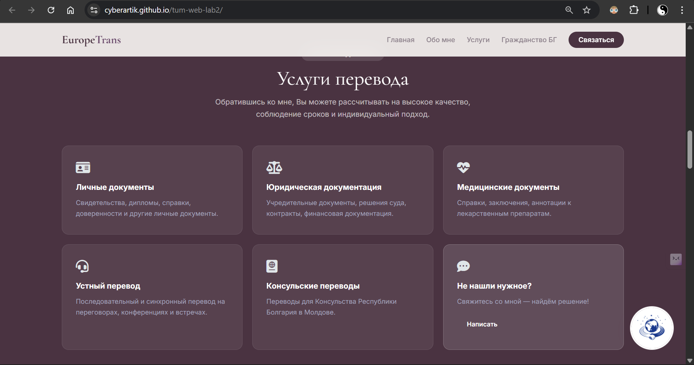

---

### Bulgarian Citizenship Section

Explains the four pathways to Bulgarian citizenship, the step-by-step process (with timeline), and an interactive FAQ accordion for the most common questions.

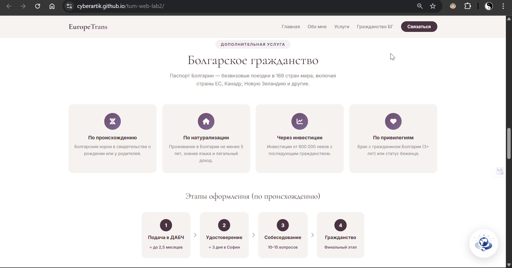

---

### Work Process Section

Four numbered steps describing how to place an order: submit → get a quote → translation → receive the result.

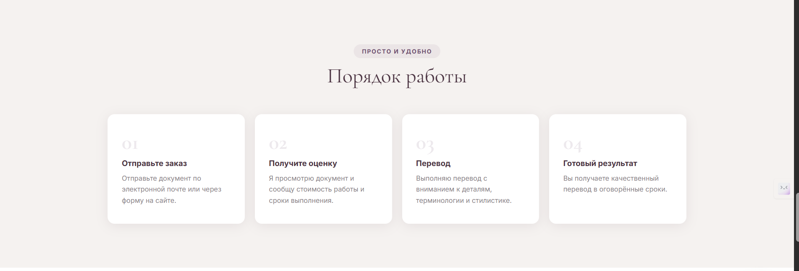

---

### Testimonials Section

Three client review cards with quotes and source labels, displayed in a 3-column grid on desktop.

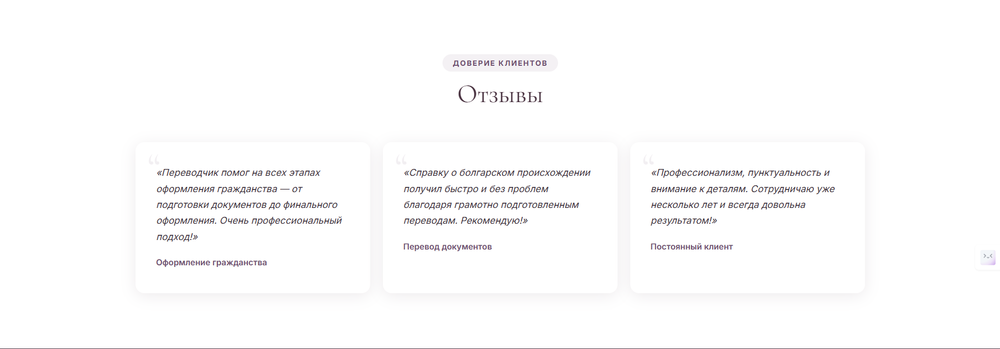

---

### Contact Section

A dark-background contact form (name, email, subject dropdown, message) alongside the translator's direct contact details (phone, email, website, location).

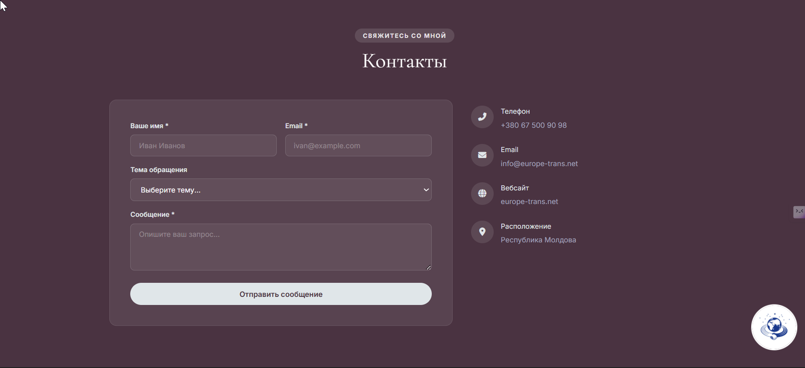

---

### Footer

The footer contains the EuropeTrans logo, a short tagline, quick contact links, copyright, and the legal registration notice (Law №264 of 11.12.2008, Republic of Moldova).

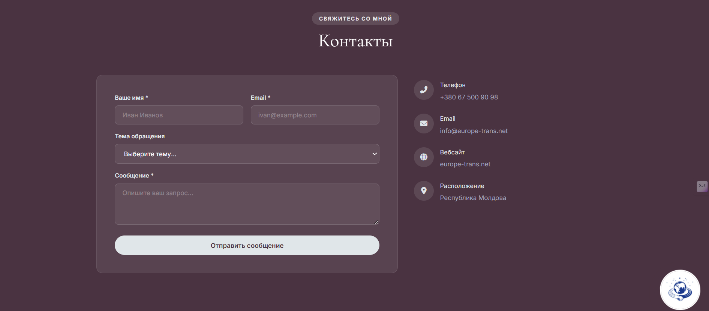

---

### Mobile Version

On screens ≤ 768px the layout fully adapts: hamburger navigation, stacked sections, full-width buttons, and a sticky "Order Translation" CTA bar pinned to the bottom of the screen.

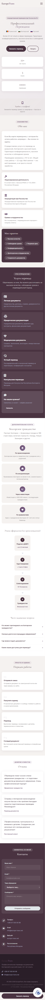

---

### Mobile Navigation (Hamburger Menu)

The hamburger menu expands to reveal all navigation links with proper touch-friendly tap targets.

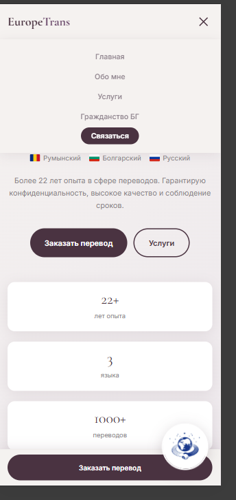

---

### Mascot

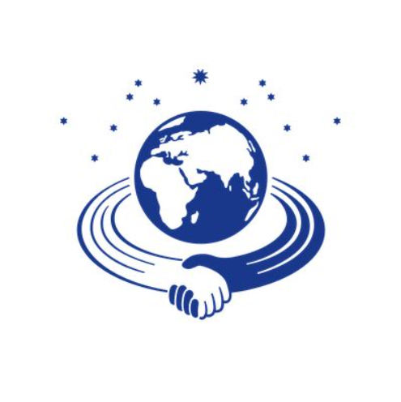

---

### Live

https://cyberartik.github.io/tum-web-lab2/

